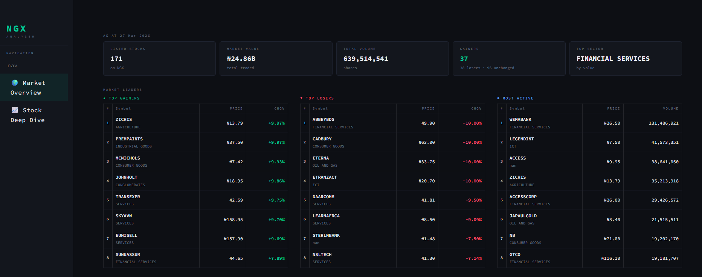
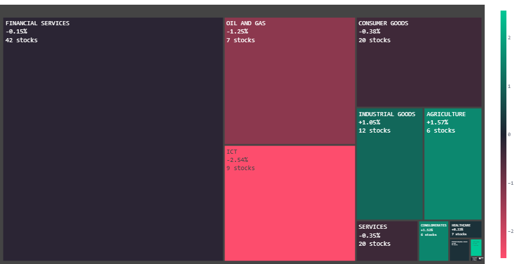
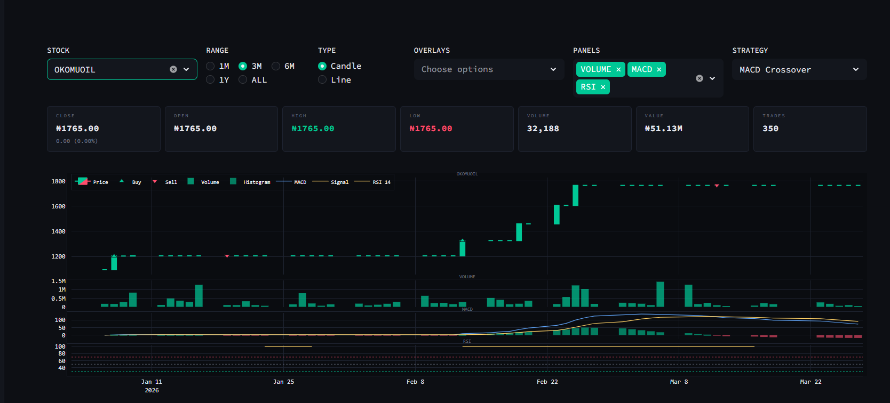
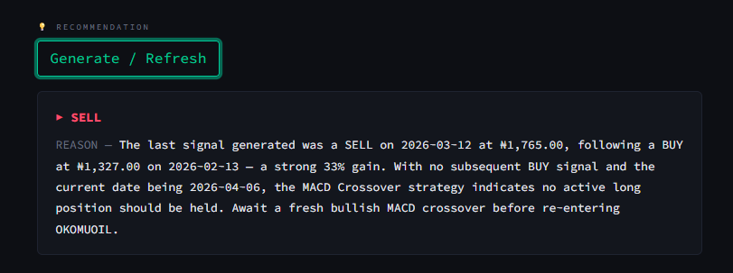

# EquityLens NG — Market Intelligence Dashboard


A Streamlit-based technical analysis dashboard for equities listed on the **Nigerian Exchange (NGX)**. Real-time data from MongoDB Atlas (populated by the NGX crawler). Indicators computed in pure pandas; trading signals from rule-based strategies; AI recommendations via Claude, GPT-4o, or Gemini through LangChain.

**Features:**

- 📊 Real-time market overview & sector analysis
- 🔍 Deep-dive stock analysis with custom date ranges
- 📈 5 technical indicators (SMA, EMA, RSI, MACD, Bollinger Bands)
- 🎯 3 trading signal strategies (MACD, RSI, SMA Crossover)
- 🤖 AI-powered buy/sell recommendations (Claude, GPT-4o, Gemini)
- 🔐 Role-based authentication (admin/user)

---

## Screenshots

### Market Overview



### Sector Overview



### Stock Deep Dive



### AI Recommendation



---

## Architecture

```text
app.py  (st.set_page_config + sidebar router + auth gate)
  │
  ├── views/login.py                 (Login + password verification)
  │
  ├── views/market_overview.py        (Daily market snapshot)
  │   ├── charts/market_overview.py   (Plotly figures)
  │   └── data/loader.py              (MongoDB queries, cached)
  │
  └── views/deep_dive.py              (Stock analysis + signals + AI)
      ├── charts/deep_dive.py         (Candlestick, signal, summary charts)
      ├── data/loader.py              (OHLCV data, date bounds)
      ├── data/indicators.py          (SMA, EMA, RSI, MACD)
      ├── analysis/signals.py         (Buy/sell signal generation)
      └── analysis/recommender.py     (LangChain + Claude/GPT-4o/Gemini)
```

**Database:** MongoDB Atlas collection `tradesData` (shared with NGX crawler pipeline)

**Layer rules:**

- `app.py` — Page routing, session state, auth gate
- `views/` — Streamlit rendering only; no chart building, no direct queries
- `charts/` — Accept DataFrames, return Plotly `go.Figure`; no `st.*` calls
- `data/loader.py` — All MongoDB queries, cached with `@st.cache_data`
- `data/indicators.py` — Stateless pandas functions; no I/O or side effects
- `analysis/signals.py` — Strategy functions return `(buy_df, sell_df)`; registered in `STRATEGIES` dict
- `analysis/recommender.py` — LangChain chains for AI recommendations
- `utility/auth.py` — MongoDB-backed auth with PBKDF2-HMAC password hashing
- `utility/db.py` — SQL Server connection (legacy, deprecated)
- `config.py` — Colors, layout defaults, constants

---

## Authentication

Login gate backed by MongoDB (`users` collection). Default admin account created on first run:

| Field | Value |
|---|---|
| Username | `ADMIN_USERNAME` from `.env` (default: `admin`) |
| Password | `ADMIN_PASSWORD` from `.env` (default: `admin123`) |
| Role | `admin` |

**Security:** Passwords hashed with PBKDF2-HMAC-SHA256 (no plaintext storage).

**Admin features:**

- Create, activate/deactivate users
- Manage roles (admin, user)
- View user audit logs

---

## Technical Indicators

All computed in `data/indicators.py` using `ClosePrice`:

| Indicator | Function | Windows | Output |
| --- | --- | --- | --- |
| SMA | `calculate_sma(series, window)` | 50, 200 | Simple Moving Average |
| EMA | `calculate_ema(series, window)` | 12, 26 | Exponential Moving Average |
| RSI | `calculate_rsi(series, window)` | 14 | Relative Strength Index (0–100) |
| MACD | `calculate_macd(series, short, long, signal)` | 12, 26, 9 | MACD line + Signal line |
| Bollinger Bands | `calculate_bollinger_bands(series, window, std_dev)` | 20, 2.0 | Upper + Lower bands |

Use `add_all_indicators(df)` to compute all at once — returns a copy of the DataFrame with new columns appended.

---

## Trading Strategies

Defined in `analysis/signals.py`. Each strategy function returns `(buy_df, sell_df)` tuples and is registered in the `STRATEGIES` dict for UI dispatch.

| Strategy | Buy Condition | Sell Condition |
| --- | --- | --- |
| `macd_signals` | MACD line crosses above Signal line | MACD line crosses below Signal line |
| `rsi_signals` | RSI crosses up through oversold (30) | RSI crosses down through overbought (70) |
| `sma_crossover_signals` | SMA 50 crosses above SMA 200 (golden cross) | SMA 50 crosses below SMA 200 (death cross) |

Signals are visualized on the chart and summarized in the "Signal Summary" panel on the Deep Dive page.

---

## Database

MongoDB Atlas collection `tradesData` populated by the NGX crawler pipeline.

### tradesData Collection

| Field | Type | Notes |
| --- | --- | --- |
| `Symbol` | string | NGX ticker (e.g., "DANGCEM") |
| `TradeDate` | string | Exchange date (mixed type: string or datetime) |
| `fetched_at` | datetime | BSON timestamp; WAT-aware; primary time axis |
| `OpeningPrice` | float | Daily opening price (NGN) |
| `HighPrice` | float | Daily high |
| `LowPrice` | float | Daily low |
| `ClosePrice` | float | Daily close (used for all indicator calculations) |
| `PrevClosingPrice` | float | Previous day close |
| `Change` | float | Absolute change (ClosePrice - PrevClosingPrice) |
| `PercChange` | float | % change |
| `Volume` | integer | Trading volume (shares) |
| `Value` | float | Value traded (NGN) |
| `Trades` | integer | Number of trades |
| `Sector` | string | Industry sector |
| `Company2` | string | Company display name |

**Key constraint:** Unique index on `(Symbol, fetched_at)` to prevent duplicate inserts from crawler.

**Data deduplication:** Per-symbol, one record per calendar day (most recent `fetched_at` for that day).

---

## AI Recommendations

Generate stock recommendations using Claude, GPT-4o, or Gemini via LangChain.

**Architecture** (`analysis/recommender.py`):

```python
from langchain_core.prompts import PromptTemplate
from langchain_core.output_parsers import StrOutputParser

chain = PromptTemplate(...) | llm | StrOutputParser()
recommendation = chain.invoke({"signals": buy_sell_data, "stock": symbol})
```

**Supported Models:**

| Provider | Model | Notes |
| --- | --- | --- |
| Anthropic | `claude-opus-4-7` | Best for nuanced financial narrative |
| OpenAI | `gpt-4o` | Fast, multimodal capable |
| Google | `gemini-1.5-pro` | Cost-effective alternative |

**Flow:** Buy/sell signals → LLM prompt → Returns `Recommendation: BUY / SELL / HOLD` with reasoning.

**Caching:** Result cached in `st.session_state` until user clicks **Generate / Refresh**.

**Admin vs User:** Admins use env API keys; non-admins paste their own API key in the UI.

---

## Tech Stack

| Component | Library | Version |
| --- | --- | --- |
| **UI** | Streamlit | ≥ 1.35 |
| **Charts** | Plotly | ≥ 5.22 |
| **Data** | pandas + pymongo | ≥ 2.0, ≥ 4.0 |
| **Indicators** | Pure pandas | No external TA libraries |
| **AI/LLM** | LangChain + Anthropic/OpenAI/Google | Latest |
| **Authentication** | pymongo + hashlib (PBKDF2-HMAC) | Built-in |
| **Config** | python-dotenv + pytz | ≥ 1.0 |

See `requirements.txt` for full dependency list.

---

## Setup

### 1. Create a virtual environment

```bash
cd platformApp
python -m venv venv
source venv/Scripts/activate      # Windows bash
# or: venv\Scripts\activate.bat
```

### 2. Install dependencies

```bash
pip install -r requirements.txt
```

### 3. Configure environment

Create `platformApp/.env`:

```env
MONGODB_URI=mongodb+srv://<user>:<password>@<cluster>.mongodb.net/
MONGODB_DB=db_name_here
ADMIN_USERNAME=username_here
ADMIN_PASSWORD=password_here
ANTHROPIC_API_KEY=your_key_here
OPENAI_API_KEY=your_key_here
GEMINI_API_KEY=your_key_here
```

### 4. Run

```bash
streamlit run app.py
# → http://localhost:8501
```

**First login:**

- Username: `admin` (or `ADMIN_USERNAME` from `.env`)
- Password: `admin123` (or `ADMIN_PASSWORD` from `.env`)

---

## Known Issues & Fixes

| Issue | Status | Notes |
| --- | --- | --- |
| Date range crash on single-day database | ✅ Fixed | Clamp default with `max(max_date - timedelta(days=90), min_date)` |
| Login page card fixed width | ✅ Fixed | CSS changed from `width: 600px` to `width: 100%; box-sizing: border-box;` |
| Weekly/monthly totals inaccurate | ✅ Fixed | Changed aggregation to use `$dateToString($fetched_at)` instead of `$substr($TradeDate)` |
| NaN values crash sector cards | ✅ Fixed | Added `math.isnan()` filter before computing bar widths |

---

## Troubleshooting

### MongoDB connection timeout

**Error:** `pymongo.errors.ServerSelectionTimeoutError`

**Fix:**

- Check `MONGODB_URI` is correct
- In MongoDB Atlas, allow all IPs in Network Access (or add your IP)
- Test locally: `python -c "from pymongo import MongoClient; MongoClient('YOUR_URI').admin.command('ping')"`

### Missing data in date range

**Symptom:** "No data for selected range" even though data exists

**Cause:** Wrong collection name or data hasn't been backfilled

**Fix:**

- Verify `MONGODB_DB` points to correct database
- Check MongoDB Atlas for `tradesData` collection
- Run ngxPro crawler to populate current data

### API key errors

**Claude:** `AuthenticationError` → Check `ANTHROPIC_API_KEY` is valid and has quota

**GPT-4o:** `RateLimitError` → Wait, then refresh. Check OpenAI account balance.

**Gemini:** `ResponseValidationError` → Update `langchain-google-genai` package

### Login page unresponsive

**Issue:** Login card doesn't resize on mobile

**Status:** ✅ Fixed in May 2026 — CSS uses `width: 100%; box-sizing: border-box;` for responsiveness

---

## Development

### Adding a new trading strategy

1. Create function in `analysis/signals.py`:

```python
def my_new_strategy(df: pd.DataFrame) -> tuple:
    """Returns (buy_df, sell_df)"""
    # Your logic here
    buy_signals = df[...]
    sell_signals = df[...]
    return buy_signals, sell_signals
```

1. Register in `STRATEGIES` dict:

```python
STRATEGIES = {
    "My Strategy": my_new_strategy,
    ...
}
```

1. Strategy automatically appears in Deep Dive "STRATEGY" dropdown

### Adding a new page

1. Create `views/my_page.py`
1. Implement `render()` function
1. Add to sidebar router in `app.py`:

```python
if page == "My Page":
    from views.my_page import render
    render()
```

### Local testing without MongoDB

Use `@st.cache_data` mock decorator:

```python
@st.cache_data
def load_stock_list_mock():
    return ["DANGCEM", "GTCO", "MTNN", ...]
```

---

## Performance Tips

1. **Caching:** All queries use `@st.cache_data` — results cached per session. Clear cache if data is stale.
2. **Date ranges:** Avoid selecting > 2 years of data; MongoDB aggregations can take 30+ seconds.
3. **AI recommendations:** Use `max_tokens=512` to keep responses fast and concise.
4. **Charts:** Plotly renders client-side in browser — faster than server-side rendering.

---

## Contributing

- Follow layer rules: views don't call queries, charts don't call `st.*`
- Use type hints: `def load_stock_data(symbol: str) -> pd.DataFrame:`
- Cache expensive operations: Wrap in `@st.cache_data`
- Test locally before committing: `streamlit run app.py`

---

## Resources

- **Streamlit docs:** [https://docs.streamlit.io](https://docs.streamlit.io)
- **Plotly reference:** [https://plotly.com/python/](https://plotly.com/python/)
- **MongoDB aggregation:** [https://docs.mongodb.com/manual/reference/operator/aggregation/](https://docs.mongodb.com/manual/reference/operator/aggregation/)
- **LangChain:** [https://python.langchain.com](https://python.langchain.com)
- **Claude API:** [https://docs.anthropic.com](https://docs.anthropic.com)

---

**Last updated:** May 2026 | **Status:** Production ✅
